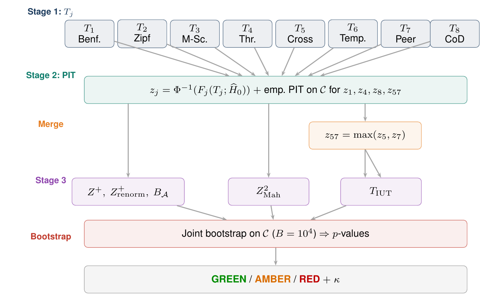
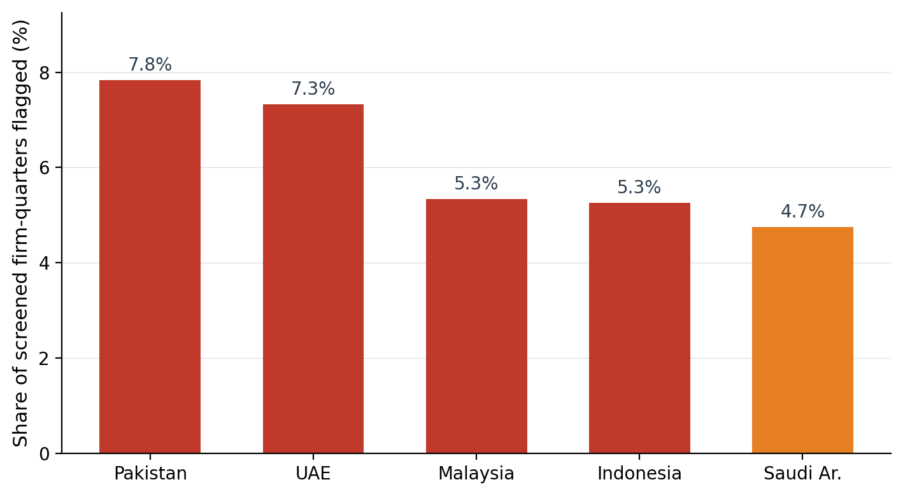

# Below the Line: Detecting Accounting Anomalies in Shariah-Compliant Equities

This repository (*ShariaSentinel*) reproduces the empirical results of the paper on
statistical anomaly screening for Sharia compliance. It ships the scoring and
robustness pipeline as code only: run it against the reconstructed per-country
panels and the tables and figures in the paper regenerate from a single command.
It does not include the application and serving code, the unit-test suite, or the
raw vendor data. The reconstructed panels carry licensed Compustat fields and are
not versioned here; they are available on motivated request (see Data).

## In plain terms

Sharia screening decides whether a listed company can be labelled Sharia
compliant. The decision uses simple caps on a few financial ratios, for example
how much debt a company carries relative to its assets. Because these caps are
public, a company sitting just inside a cap has a reason to make its reported
numbers look better than they are.

This project is a statistical second opinion on those reported numbers. It runs
eight independent checks on a company's public quarterly financial statements:
whether the leading digits look natural, whether the figures stay consistent
across statements and over time, whether the company looks like its industry
peers, and so on. Each check is placed on the same scale, and the checks are
combined into a single score. A high score means the reported figures look
unusual and deserve a closer look by a human reviewer. It does not prove
wrongdoing; it points to the firms worth examining. The same checks run across
five countries with no change to the method.



*Figure 1. The screening pipeline. Eight detectors are computed from the public
statements, placed on one common scale, merged into five summary scores, and
turned into a GREEN, AMBER, or RED verdict for each company-quarter.*

## Takeaway

You can check a Sharia-compliant label using only public accounts, and the same
check works across five countries with no change to the method. It reads the
reported figures of firms that are labelled compliant and points out the ones
that do not look like an honest firm's accounts. A flag is not proof of
wrongdoing; it tells a human reviewer where to look. Gaming the check is hard:
turning a flagged firm into an unflagged one takes coordinated edits to several
income-statement lines at once, not a single number, and a direct attack on the
score fails.

## Flag rate by country

Among the screened firm-quarters (those whose reported ratios sit within their
country's caps), the flagged share stays in the same single-digit band
everywhere, from Saudi Arabia at the bottom to Pakistan at the top. The large
anchor panel (Malaysia) sits in the middle of the range, alongside Indonesia.



*Figure 2. Share of screened firm-quarters flagged as anomalous (p < 0.01), by
country, sorted from most to least. Numbers are regenerated from the panels in
this repository.*

## About the paper

Sharia screening assigns a binary compliance label to listed firms using ratio
caps computed from firm-reported statements. Because the thresholds are public
and the label carries economic consequences, firms near a cap have an incentive
to manage the inputs. The paper presents a framework that produces an
independent statistical plausibility check from public data alone, and that does
not depend on which authority performs the screening.

Eight forensic detectors (Benford digit distribution, Zipf rank-size, a
Sharia-adapted Beneish M-Score, threshold proximity, cross-statement coherence,
temporal consistency, a peer-group Mahalanobis distance, and a cost-of-debt
break) are mapped to a common standard-normal scale through the probability
integral transform, then aggregated into covariance-aware and unanimity
composites with non-parametric bootstrap calibration on an authority-specific
reference sample.

The framework is validated across five Sharia-screening regimes: Malaysia
(SC/SAC), Indonesia (OJK/DES), Pakistan (PSX/KMI), Saudi Arabia (Boubyan
Capital, a third-party provider list, as there is no official regulator list), and
the UAE (DFM). Together these span 3,494 firms and 224,576 firm-quarters, two
list conventions (authorities that publish non-compliant verdicts and
authorities that publish only compliant constituents), and debt caps ranging
from 30% to 45%. On the 27-year Malaysian anchor panel (1,356 firms, 92,872
firm-quarters), the framework flags 5.3% of ratio-compliant firm-quarters as
anomalous, and under firm-level Benjamini-Hochberg control the unanimity test
flags 319 firms (23.5%) at q below 0.01. A controlled injection study yields at least 93%
detection power at three-sigma on realistic archetypes, and an end-to-end
contamination study reports an AUC of 0.86 for digit distortions, while
synthetic cost-of-debt breaks stay near chance. Recalibrated on each authority's reference sample,
the same detector stack applies to all five regimes with no further
modification.

## Research questions and hypotheses

The framework answers four questions and tests six predictions drawn from the
accounting-threshold and forensic-accounting literature.

Questions:

1. Can public financial statements alone build an independent, authority-agnostic
   check on Sharia-compliance labels?
2. Do the firms and firm-quarters it flags correspond to economically legible
   reporting profiles rather than sampling or multiple-testing noise?
3. Does the same framework, recalibrated per authority, transfer across screening
   regimes with comparable error rates?
4. How costly is it for a firm to move from a flagged to an unflagged state?

Predictions:

- **H1 (steering near the cap).** Firms steer reported ratios near the debt cap,
  so the flagged share rises as the cap is approached; low-debt firms are also
  flagged by the peer detectors, giving a U-shape of flagged share against
  leverage.
- **H2 (legible flags).** Flags concentrate in interpretable accounting profiles
  and survive strict firm-level false-discovery control, so the signal is not
  multiple-testing noise.
- **H3 (cross-regime transfer).** Recalibrated on each authority, the framework
  holds its false-positive rate near nominal and its flag share in the same range
  across all five regimes.
- **H4 (bounded evasion cost).** The smallest edit that clears a flag is a
  coordinated retouch of several income-statement lines at once, not a
  single-line adjustment.
- **H5 (temporal stability).** The probability-integral-transform calibration
  keeps the false-positive rate near nominal at both near and far time horizons.
- **H6 (correlation cost).** Detector correlation dilutes the unanimity test's
  power below its independent benchmark, by a measurable power gap.

## Data

The firm-level financials used to build the panels come from S&P Global
Compustat. The Compustat license does not permit redistributing the underlying
vendor data, and the reconstructed panels still carry licensed Compustat fields,
so **this repository ships code only**: neither the raw source nor the
reconstructed panels are included. The reconstructed panels can be shared on a
motivated request: state who you are and the intended research use, and send it
to the corresponding author (contact withheld for double-blind review). Data
will be shared to the extent the S&P Compustat license allows.

To reproduce, obtain the panels and place them under `data/` as shown in the
Layout below, then run the pipeline. Without them the code is complete but has
nothing to run on.

## Layout

```
reproduce.py                  single deterministic entry point (run one step or all)
numbers_manifest.json         the published manifest, to diff your run against
requirements.txt
src/                          the reproduction package, split by role
  common/                     shared constants, settings, per-country methodology, ratios inputs
  data/                       reads the shipped transformed panel; Sharia-ratio construction
  engine/                     the eight detectors, PIT calibration, composites, bootstrap, z-scores
  analysis/                   reference sample, calibration, FDR, robustness benchmark,
                              counterfactual and SAC-projected PGD evasion, ablation
  figures/                    scripts that regenerate the figure data and the numbers manifest
data/                         not in the repository, obtain on request (see Data)
  README.md                   the input schema (the only versioned file here)
  panel/<country>/compustat_quarterly.parquet
                              reconstructed panel per country (mys, idn, uae, sau, pak);
                              the pipeline regenerates every run output from it
  scores/<country>/phase0_reference_sample/panel_with_split.parquet
                              the same panel carrying the reference-sample split,
                              read directly by the scoring, benchmark, and counterfactual steps
```

The package follows the canonical role split (`common`, `data`, `engine`,
`analysis`, `figures`); each module carries one responsibility, and layers are
read data, then compute, then analyse, then figures.

## Setup

```bash
python -m venv .venv && source .venv/bin/activate
pip install -r requirements.txt
```

Runs on CPU. `torch` uses CUDA automatically if a GPU is available (optional).

## Usage

Every analysis is a subcommand of `reproduce.py`. The shared option is
`--country {mys,idn,uae,sau,pak}` (default `mys`). All results are written
under `data/scores/<country>/` (git-ignored; only the input panels are
versioned). Run `python reproduce.py <command> --help` for the full option list.

### Quick reference

| Command | Reproduces | Typical runtime |
|---|---|---|
| `pipeline` | phases 0 to 7: reference sample, flag rate, calibration, FDR tables | minutes |
| `score` | detector z-scores (z1 to z9, then z57) | seconds to minutes |
| `benchmark` | robustness families 1 to 4 (incl. AnoShift) | minutes to hours |
| `ablation` | detector-ablation table (full model and four ablations) | tens of minutes |
| `family3-cf` | counterfactual RED to GREEN flip rate and variable composition | about 1 h at 500 rows |
| `family3-pgd` | SAC-projected PGD adversarial-evasion result | minutes |
| `all` | `score` then `benchmark` | as above |

Start with `pipeline`: it is the command that regenerates the headline numbers
(flag rate, reference sample, false-discovery counts) from the reconstructed
panel. The other commands read the phase outputs it writes.

### `pipeline`: phases 0 to 7

Rebuilds the whole scored chain from the reconstructed panel: the reference
sample under the authority's active ratio screens, the detector z-scores, the
composites with their bootstrap null, and the firm-level false-discovery
control. This is the command behind the paper's flag rate, calibration, and FDR
tables.

```bash
python reproduce.py pipeline --country mys
```

Writes the phase outputs under `data/scores/<country>/`.

### `score`: detector z-scores

Recomputes all detector z-scores from the reconstructed panel, which is the
input to every downstream table.

```bash
python reproduce.py score --country mys
```

Writes `data/scores/<country>/z_scores.parquet`.

### `benchmark`: robustness families 1 to 4

Runs the full robustness benchmark: Family 1 (correlated-Gaussian
contamination), Family 2 (realistic manipulation mechanisms), Family 3
(adversarial), and Family 4 (AnoShift temporal robustness). This is the slow
command. The abstract's end-to-end contamination AUC (0.86 for digit
distortions, near chance for cost-of-debt breaks) is the Family 2 output
`robustness_benchmark/paper_ready/contamination_auc_table.csv`.

```bash
python reproduce.py benchmark --country mys              # resumes from checkpoints
python reproduce.py benchmark --country mys --no-resume  # recompute every family
```

Writes tables and figures under `data/scores/<country>/robustness_benchmark/`.

### `ablation`: detector-ablation table

Reruns the pipeline under the full model and four ablations (no annual
cash-flow recovery, no z5/z7 merge, no Monte-Carlo Benford calibration, no
peer-group Mahalanobis) and reports how each one moves the discovery counts and
the overlap with the full model.

```bash
python reproduce.py ablation --country mys
```

Writes `data/scores/mys/qualitative/ablation_results.csv`.

### `family3-cf`: counterfactual (RED to GREEN)

Finds the smallest accounting move that flips a near-boundary RED firm-quarter
to GREEN, and reports the flip rate and the per-variable perturbation
composition (paper section "Adversarial counterfactual robustness").

```bash
# headline paper run: 500 near-boundary RED rows, 19-field attack surface
python reproduce.py family3-cf --country mys --rows 500 --near-boundary
```

Options:
- `--rows N`: number of firm-quarters to attack (default 500).
- `--near-boundary`: select the top-N RED rows closest to the threshold
  (deterministic); omit to use the package's seeded eligible-pool sample.
- `--target {z_plus_renorm,z_plus,breadth,z_mahalanobis_sq,t_iut}`: target
  composite (default `z_plus_renorm`, the renormalised truncated sum).
- `--direction {to_green,to_red}`: flip direction (default `to_green`).

Prints the flip rate and writes the per-row results CSV under
`data/scores/<country>/robustness_benchmark/`.

### `family3-pgd`: SAC-projected PGD evasion

Runs the projected-gradient adversarial-evasion attack on the highest-risk RED
rows, projecting every step back onto the SAC ratio constraints, and reports the
evasion rate at eps in {0, 0.05} (paper section "Adversarial evasion").

```bash
python reproduce.py family3-pgd --country mys --rows 5
```

Options: `--rows N`, the number of highest-risk RED rows to attack (default 5).
Prints the evasion rate per epsilon level.

### `all`: score then benchmark end-to-end

```bash
python reproduce.py all --country mys
```

## Checking your reproduction

Two read-only tools turn a finished run into something you can compare against
the published results. Neither recomputes anything.

```bash
python dump_paper_numbers.py       # -> a manifest of your reproduced numbers
python dump_paper_figure_data.py   # -> figures/data/*.csv behind the paper's figures
```

`numbers_manifest.json` in this repository is the published manifest: diff your
own against it to confirm the reproduction matches. Sections this repository
generates on demand rather than shipping (the counterfactual and the end-to-end
contamination table) stay marked missing until you run the matching command.
Run `pipeline` first, then `benchmark` and `family3-cf` if you want the
robustness and near-red figures covered.

## Notes on reproducibility

- The reconstructed panels already carry the reference-sample split (`_split`),
  so `score` recomputes all detector z-scores directly from them; no raw
  Compustat data is required.
- Randomised steps (bootstrap nulls, Family-3 candidate sampling) are seeded
  through the settings in `src/common/config.py`, so runs are
  deterministic.
