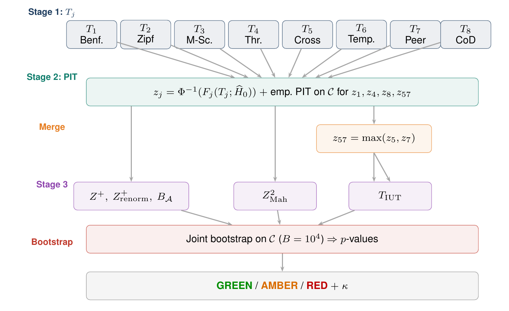

# ShariaSentinel

This repository reproduces the empirical results of the ShariaSentinel paper on
statistical anomaly screening for Sharia compliance. It ships the scoring and
robustness pipeline together with the reconstructed per-country panels, so the
tables and figures in the paper can be regenerated from a single command. It
does not include the application and serving code, the unit-test suite, or the
raw vendor data; only the reconstructed panels needed for reproduction are
versioned here.

## In plain terms

Sharia screening decides whether a listed company can be labelled Sharia
compliant. The decision uses simple caps on a few financial ratios, for example
how much debt a company carries relative to its assets. Because these caps are
public, a company sitting just inside a cap has a reason to make its reported
numbers look better than they are.

This project is a statistical second opinion on those reported numbers. It runs
eight independent checks on a company's public quarterly financial statements:
whether the leading digits look natural, whether the figures stay consistent
across statements and over time, whether the company looks like its industry
peers, and so on. Each check is placed on the same scale, and the checks are
combined into a single score. A high score means the reported figures look
unusual and deserve a closer look by a human reviewer. It does not prove
wrongdoing; it points to the firms worth examining. The same checks run across
five countries with no change to the method.



*Figure 1. The screening pipeline. Eight detectors are computed from the public
statements, placed on one common scale, merged into five summary scores, and
turned into a GREEN, AMBER, or RED verdict for each company-quarter.*

## About the paper

Sharia screening assigns a binary compliance label to listed firms using ratio
caps computed from firm-reported statements. Because the thresholds are public
and the label carries economic consequences, firms near a cap have an incentive
to manage the inputs. The paper presents a framework that produces an
independent statistical plausibility check from public data alone, and that does
not depend on which authority performs the screening.

Eight forensic detectors (Benford digit distribution, Zipf rank-size, a
Sharia-adapted Beneish M-Score, threshold proximity, cross-statement coherence,
temporal consistency, a peer-group Mahalanobis distance, and a cost-of-debt
break) are mapped to a common standard-normal scale through the probability
integral transform, then aggregated into covariance-aware and unanimity
composites with non-parametric bootstrap calibration on an authority-specific
reference sample.

The framework is validated across five Sharia-screening regimes: Malaysia
(SC/SAC), Indonesia (OJK/DES), Pakistan (PSX/KMI), Saudi Arabia (Boubyan), and
the UAE (DFM). Together these span 3,181 firms and 210,662 firm-quarters, two
list conventions (authorities that publish non-compliant verdicts and
authorities that publish only compliant constituents), and debt caps ranging
from 30% to 45%. On the 27-year Malaysian anchor panel (1,043 firms, 78,958
firm-quarters), the framework flags 5.2% of ratio-compliant firm-quarters as
anomalous, and under firm-level Benjamini-Hochberg control 169 firms (16.2%)
survive at q below 0.01. A controlled injection study yields at least 89%
detection power at three-sigma on realistic archetypes, and an end-to-end
contamination study reports an AUC of 0.81 for digit distortions and 0.71 for
selective debt manipulation. Recalibrated on each authority's reference sample,
the same detector stack applies to all five regimes with no further
modification.

## Raw data

The raw firm-level financials used to build the panels come from S&P Global
Compustat. The Compustat license does not permit us to redistribute the
underlying vendor data, so this repository ships only the reconstructed panels
derived from it, not the raw source. Access to the raw data can therefore only
be granted on a motivated request: state who you are and the intended research
use, and send it to geoffrey.ducournau@111dimtech.com. Data will be shared to
the extent the S&P Compustat license allows.

## Layout

```
main.py                       single argparse entry point (run one step or all)
requirements.txt
shariasentinel/               the pipeline package
  common/  panel/             ratio construction, per-country methodology
  detectors/                  z1 to z9 anomaly detectors, plus PIT calibration
  scoring/                    composites, bootstrap nulls, phase runners, config
  robustness/                 robustness benchmark (families 1 to 4)
    family3_counterfactual/   counterfactual and SAC-projected PGD evasion
data/
  scores/<country>/phase0_reference_sample/panel_with_split.parquet
                              reconstructed panels (mys, uae, qat, sau, pak, kwt)
```

## Setup

```bash
python -m venv .venv && source .venv/bin/activate
pip install -r requirements.txt
```

Runs on CPU. `torch` uses CUDA automatically if a GPU is available (optional).

## Usage

Every analysis is a subcommand of `main.py`. The shared option is
`--country {mys,uae,qat,sau,pak,kwt}` (default `mys`). All results are written
under `data/scores/<country>/` (git-ignored; only the input panels are
versioned). Run `python main.py <command> --help` for the full option list.

### Quick reference

| Command | Reproduces | Typical runtime |
|---|---|---|
| `score` | detector z-scores (z1 to z9, then z57) | seconds to minutes |
| `benchmark` | robustness families 1 to 4 (incl. AnoShift) | minutes to hours |
| `family3-cf` | counterfactual RED to GREEN flip rate and variable composition | about 1 h at 500 rows |
| `family3-pgd` | SAC-projected PGD adversarial-evasion result | minutes |
| `all` | `score` then `benchmark` | as above |

### `score`: detector z-scores

Recomputes all detector z-scores from the reconstructed panel, which is the
input to every downstream table.

```bash
python main.py score --country mys
```

Writes `data/scores/<country>/z_scores.parquet`.

### `benchmark`: robustness families 1 to 4

Runs the full robustness benchmark: Family 1 (correlated-Gaussian
contamination), Family 2 (realistic manipulation mechanisms), Family 3
(adversarial), and Family 4 (AnoShift temporal robustness). This is the slow
command.

```bash
python main.py benchmark --country mys              # resumes from checkpoints
python main.py benchmark --country mys --no-resume  # recompute every family
```

Writes tables and figures under `data/scores/<country>/robustness_benchmark/`.

### `family3-cf`: counterfactual (RED to GREEN)

Finds the smallest accounting move that flips a near-boundary RED firm-quarter
to GREEN, and reports the flip rate and the per-variable perturbation
composition (paper section "Adversarial counterfactual robustness").

```bash
# headline paper run: 500 near-boundary RED rows, 19-field attack surface
python main.py family3-cf --country mys --rows 500 --near-boundary
```

Options:
- `--rows N`: number of firm-quarters to attack (default 500).
- `--near-boundary`: select the top-N RED rows closest to the threshold
  (deterministic); omit to use the package's seeded eligible-pool sample.
- `--target {z_plus_renorm,z_plus,breadth,z_mahalanobis_sq,t_iut}`: target
  composite (default `z_plus_renorm`, the renormalised truncated sum).
- `--direction {to_green,to_red}`: flip direction (default `to_green`).

Prints the flip rate and writes the per-row results CSV under
`data/scores/<country>/robustness_benchmark/`.

### `family3-pgd`: SAC-projected PGD evasion

Runs the projected-gradient adversarial-evasion attack on the highest-risk RED
rows, projecting every step back onto the SAC ratio constraints, and reports the
evasion rate at eps in {0, 0.05} (paper section "Adversarial evasion").

```bash
python main.py family3-pgd --country mys --rows 5
```

Options: `--rows N`, the number of highest-risk RED rows to attack (default 5).
Prints the evasion rate per epsilon level.

### `all`: score then benchmark end-to-end

```bash
python main.py all --country mys
```

## Notes on reproducibility

- The reconstructed panels already carry the reference-sample split (`_split`),
  so `score` recomputes all detector z-scores directly from them; no raw
  Compustat data is required.
- Randomised steps (bootstrap nulls, Family-3 candidate sampling) are seeded
  through the settings in `shariasentinel/scoring/config.py`, so runs are
  deterministic.
